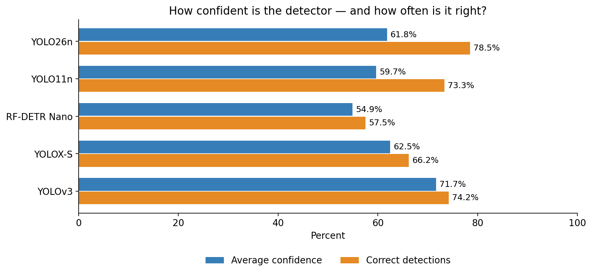
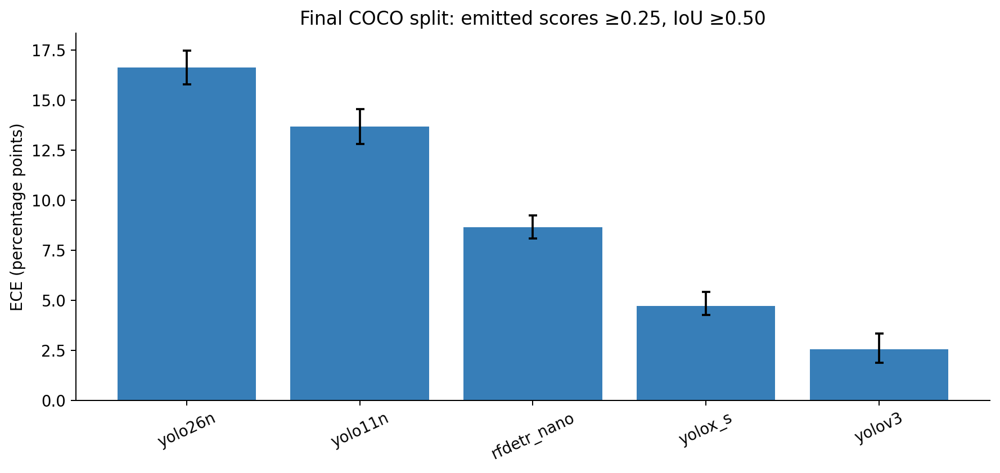
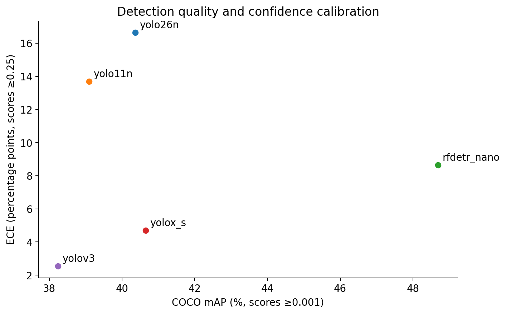
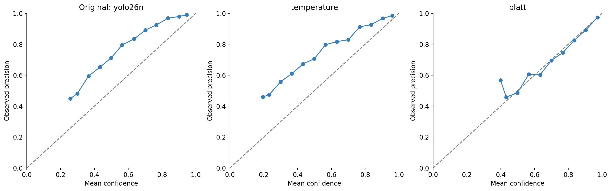

# Can you trust an object detector’s confidence?

An object detector draws a box around an object, names it, and gives it a confidence score. A score of 0.90 sounds like a 90% chance of being right. But does the detector actually get about nine out of ten similar predictions right? That can be checked against labeled images.

The chart below compares average confidence with the share of correct detections. When the two bars line up, the average score agrees with the results. A shorter confidence bar means the model is too cautious on average. A taller one means it is too confident. Matching averages alone does not prove that every score range is reliable.

For **YOLO26n**, average confidence was **61.81%**, but **78.45%** of its detections were correct. Its scores were too low on average. A small correction can make those scores more useful without changing a single box.

## What calibration means

Calibration describes how closely confidence scores match actual results. For example, among detections scored near 0.80, about 80% should be correct. A model can find objects well and still give misleading scores. Detection quality and confidence reliability are separate things.

In this test, a detection is correct when it names the right class and its box overlaps a labeled box enough. The overlap measure is intersection over union, or IoU: the shared area divided by the total area covered by both boxes. The required IoU is at least 0.50. The standard COCO evaluator handles duplicate boxes and crowd labels. Detections it marks as ignored are left out of calibration statistics.

[Guo and colleagues](https://arxiv.org/abs/1706.04599) showed that a simple temperature adjustment could improve confidence in neural network classifiers. Their work inspired this test. It does not prove that newer object detectors give less reliable scores than older ones.

## Five models, separate data for each step

The benchmark compares YOLO26n, YOLO11n, YOLOX-S, RF-DETR Nano, and original YOLOv3 COCO weights. PicoDet was dropped after repeated GPU test failures. RTMDet-tiny and SSD300 were dropped because inference was too slow. The results therefore cover five specific checkpoints, not all detector families.

The 5,000 COCO val2017 images were split using seed 42: 1,000 to choose the model to correct, 1,500 to fit and compare corrections, and 2,500 for the final test. Saved image IDs make the split repeatable. The final test images did not choose the model, fit its correction, or choose the correction method.

Each model kept its usual image processing and box filtering. Inference used FP32, kept scores of at least 0.001, and saved at most 100 detections per image. The main calibration comparison uses original scores of at least 0.25. RF-DETR output slots without a COCO class were recorded separately and excluded.

## How far off were the scores?

Expected calibration error, or ECE, gives one summary of the mismatch. Scores are divided into 15 equal-width groups. Each group’s average confidence is compared with its share of correct detections. ECE combines the absolute gaps, giving larger groups more weight. Lower ECE is better.

**YOLOv3** had the lowest final ECE: **2.55 percentage points**. YOLOv3 has lower estimated ECE than all three recent candidates in this run. This resembles [Guo’s finding](https://arxiv.org/html/1706.04599#S3): newer models can be less calibrated than older ones, even when detection or classification improves.

Why might this happen? Guo linked poorer calibration to larger networks, batch normalization, and weaker penalties on large weights. Training can also increase confidence without improving correctness. These are possible explanations, not proven causes here: model sizes and training differ. Guo’s newer classifiers were often overconfident; YOLO26n was underconfident. The similar pattern concerns calibration error, not the direction of the score mismatch.

The error bars come from 1,000 samples drawn by image, keeping all detections from each image together. Nearby estimates should be treated cautiously. Extra checks change the score threshold, overlap requirement, and number of groups. The [full methodology and tables](../README.md) also include recall, negative log likelihood, and Brier score. The latter two measure probability errors in other ways, so the conclusion does not depend only on ECE.

This chart shows the models before any score correction. Higher mAP means better detection; lower ECE means more reliable confidence. YOLO26n’s point uses its original ECE of 16.64 percentage points. The next section shows how that changes after correction.

## A small correction with a large effect

Among YOLO26n, YOLO11n, and RF-DETR Nano, **YOLO26n** had the highest ECE on the selection images. That choice was saved before fitting any correction. The selected checkpoint’s ECE interval does not overlap the other two candidate intervals.

Two methods were tested. Temperature correction uses `sigmoid(logit(score) / T)`, with positive `T`. Platt correction uses `sigmoid(a * logit(score) + b)`, with positive `a`. Both remap the score while keeping its order. Temperature correction here acts on the detector’s output score; it is an adaptation of Guo’s classifier method.

The corrections were fitted by minimizing negative log likelihood. Five rounds of validation compared them on calibration images held out from each fit. Detections from the same image stayed together. **Platt correction** won that comparison, then both methods were fitted again using all calibration images. Temperature would win a numerical tie. The selected parameters are **a=1.32653, b=1.04219**. An original score of 0.90 becomes **0.981**.

On the final test images, the chosen method reduced ECE from **16.64** to **1.31 percentage points**. The change was **-15.33**, with a paired 95% interval of **[-16.20, -13.77]** points. Negative log likelihood fell from **0.4936** to **0.4103**. The interval supports an improvement for these detections.

The comparison kept the same **10893 detections**, selected using their original scores. The 0.25 threshold was not applied again after correction. Correctness stayed at **78.45%**, and mAP stayed unchanged. The correction changed confidence, not the boxes or the objects found.

## Using this in practice

Fit a correction on images that resemble the intended use, then check it on separate images. Keep the score threshold and definition of correctness clear. Changing either can change the result.

This test covers scores for detections the model produced. It says nothing about confidence for objects the model missed. [Detection calibration research](https://arxiv.org/abs/2004.13546) also studies box location and size. Different cameras, classes, and object sizes may need their own checks. A corrected score is useful evidence, not a promise that an individual box is right.
